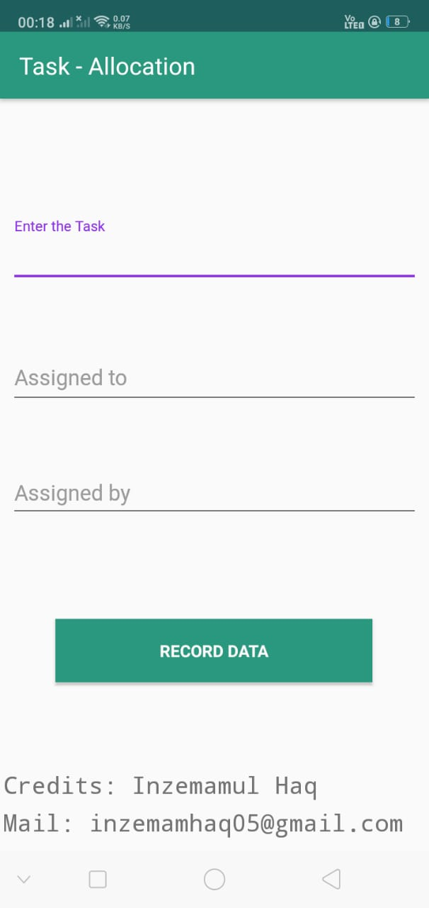

# Task-App
Hello All!
Basically this app is to assign tasks and record Data.One of the most basic but efficient work to do is to assign what you have to do.
Here, This app uses very less space, Good for personal use,Efficient and fast,Simple UI, and Easy to use.

# Problems Arised
1. Storing Data Quickly
2. View Records 
3. New Task Button in Records

# Solutions
1. We managed to make algorithms more efficient so that it surely records data and render it in View Records.
2. We made the view records option other than the home page which records new data, View Records also renders data and it has edit option so we can edit record.
3. A major problem told to us was that we need to go back to add new data, so we added a new option which add data just at the view record page.
